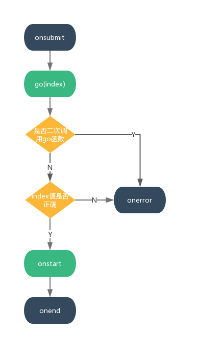

# 钩子

## 确定抽奖（onsubmit）

当用户点击抽奖按钮会触发 onsubmit() 钩子

这时一般是请求后台服务器，进行抽奖操作，请获得抽奖结果

## 开始 （go）

利用 Vue 的$ref的api调用指定抽奖组件的go()方法

注意：go(index) 方法需要接收一个奖品数组的索引值（下标）作为参数，表示最终动画停在哪个位置

__（位置从0开始）__

## 动画开始（onstart）

go 函数调用成功后回触发 onstart 钩子，表示动画开始

## 错误（onerror）

如果go函数传入的值不正确，将触发onerror钩子函数
在动画时间，再次调用go函数，将触发onerror钩子
go函数传入值应该为Number类型，奖品列表数组索引值访问

## 动画结束（onend）

动画结束后会触发 onend 钩子，并返回奖品数组中奖的对象值