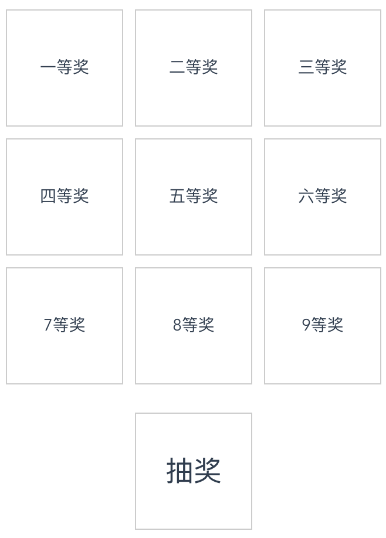
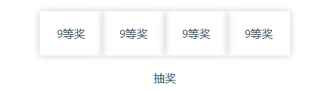

# 快速开始

直接开始

## 安装

``` sh

# vue2
npm install lattice-lottery --save

# vue3
npm install lattice-lottery-plus --save

```

## 注册

- vue2项目

``` javascript

// vue2 main.js
import Vue from 'vue'
import {
  LotteryGrid,
  LotteryList,
  SlotMachine
} from 'lattice-lottery'
import 'lattice-lottery/lib/lattice-lottery.css'

Vue.use(LotteryGrid)
Vue.use(LotteryList)
Vue.use(SlotMachine)

```

- vue3项目

``` javascript

// vue3 main.js
import { createApp } from 'vue'
import App from './App.vue'

import {
  LotteryGrid,
  LotteryList,
  SlotMachine
} from 'lattice-lottery-plus'
import 'lattice-lottery-plus/lib/lattice-lottery.css'

createApp(App).use(LotteryGrid).use(LotteryList).use(SlotMachine).mount('#app')

```

## 使用

参考Demo文档 [传送门](/lattice-lottery/demo)

## 效果图

lottery-grid


lottery-list



slot-machine

